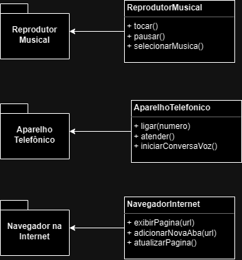

## Diagrama UML

Aqui está uma representação visual da estrutura de classes e interfaces do projeto do iPhone.

# 🚀  Construindo o Projeto do iPhone - Desafio DIO

Ao embarcar na jornada de construir o projeto do iPhone, aprendi uma série de conceitos e habilidades cruciais para o desenvolvimento de software. Este projeto me proporcionou uma experiência prática valiosa em várias áreas:

1. **Modelagem UML:** Aprendi como utilizar a linguagem de modelagem UML para representar visualmente as classes, interfaces e relacionamentos entre os componentes do sistema. Isso me permitiu planejar e comunicar eficazmente a estrutura do projeto antes de começar a codificar.

2. **Organização de Pacotes:** Compreendi a importância de organizar o código em pacotes lógicos para manter a estrutura do projeto limpa e clara. Isso facilitou a localização de classes e a gestão de dependências.

3. **Interfaces e Implementações:** Aprofundei meu conhecimento sobre o uso de interfaces em Java para definir contratos para classes. Implementar as interfaces ReprodutorMusical, AparelhoTelefonico e NavegadorInternet me ensinou como criar classes que aderem a esses contratos e fornecem funcionalidades específicas.

4. **Herança e Extensibilidade:** Entendi como usar a herança para criar classes que estendem funcionalidades existentes. Isso me permitiu criar classes concretas, como ReprodutorDeMusica, AparelhoTelefonico e NavegadorWeb, que estendem a classe iPhone.

5. **Testes e Depuração:** Aprendi a importância de testar cada funcionalidade do sistema e depurar eventuais erros. Isso me ajudou a identificar e corrigir problemas em minhas implementações.

6. **Integração de Componentes:** Experimentei a integração de várias classes e interfaces em um sistema coeso. Garantir que esses componentes funcionassem juntos harmoniosamente foi um desafio gratificante.

7. **Documentação e Boas Práticas:** Reconheci a necessidade de documentar meu código e seguir boas práticas de desenvolvimento para tornar o projeto mais compreensível e sustentável.

8. **Ponto de Entrada da Aplicação:** Compreendi como criar um ponto de entrada principal (classe Main) para iniciar e testar as funcionalidades do iPhone.

9. **Planejamento e Resolução de Problemas:** Aprendi a importância de um planejamento adequado e de resolver problemas de maneira eficiente durante o desenvolvimento.

